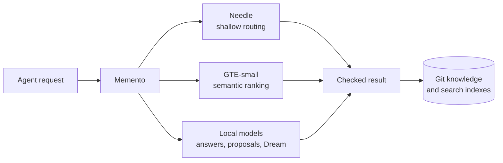

# Memento


Memento is a memory system designed to be shared by multiple agents on the same network.

Agents remember several kinds of things, and they should not all live in the same place. Conversations are short-lived context. Reminders belong to the agent that must deliver them. Credentials belong to one machine or user. Facts such as "Smith runs Piclaw", "this service replaced that one" or "the backup lives here" may need to last for years and be available to everyone.

Memento stores those shared facts. I built it for several Piclaw instances, but any MCP client can connect, search, read, submit proposals and, with curator access, publish changes.

Two small local models help with retrieval. A fine-tuned version of [`cactus-compute/needle`][needle] routes simple natural-language requests to read operations, while [`rcarmo/go-gte`][go-gte] and the [`thenlper/gte-small`][gte-small] weights find related concepts when the wording differs. Permissions and Git changes stay in Memento.



The fine-tuned Needle router maps a read request to search, status, read or graph operations, and gives up when it cannot classify one. GTE-small supplies vectors for semantic ranking. Other local models can write cited answers, draft proposals or suggest maintenance; access control and repository writes stay in Memento.

## Capabilities

* Markdown concepts with stable IDs, links and Git history.
* Authenticated MCP search, read, proposals and role-based curation for any compatible agent.
* Lexical and graph search, with optional local GTE semantic ranking.
* Proposal-first, revision-checked and idempotent Git writes.
* Versioned Git LFS asset packs, including complete recallable skills.
* Local Needle routing, GTE embeddings and optional answer/proposal/Dream models.
* Rebuildable indexes, crash recovery, backups, metrics and non-root deployment.

Tools, limits and roles are in [`docs/contracts.md`](docs/contracts.md); the storage and transaction design is in [`docs/implementation.md`](docs/implementation.md).

## Piclaw, MCP, And Agent Memory

I wrote Memento to keep my [`piclaw`][piclaw] instances up to date and sharing knowledge without making them share everything else. One handles personal work, another looks after servers, and others come and go with projects; each has its own chats, notes, reminders, tools and credentials.

Copying Markdown between them quickly creates several versions of the truth, but sharing their chat databases would mix private conversations and machine-specific state. Memento gives them one place for facts that should last, while everything local stays local.

Piclaw is how I use it, but it is not a requirement. Any MCP client can use the same authenticated tools.

```text
Personal agent ──┐
Server agent ────┼── authenticated MCP ──> Memento ──> shared Markdown knowledge
Project agent ───┘                              ├──────> operation journal
                                                └──────> search indexes
```

[`rcarmo/umcp`][umcp] provides the MCP server and transport core used for search, reads and proposals. Clients never receive direct filesystem or Git access.

## What Goes Into Shared Memory

Memento stores durable concepts: people, projects, machines, services, decisions and relationships that should outlive any one conversation. Each concept is an ordinary Markdown file with structured metadata, a stable ID and links to related concepts.

Examples include:

* where a service runs and who owns it;
* why one system replaced another;
* which project depends on a particular machine;
* aliases, tags and links needed to find the same fact later;
* reviewed operational knowledge that several agents should use consistently.

Concepts are Markdown files in Git. You can read them with a text editor, copy them elsewhere, inspect their history with Git and rebuild the search indexes.

Memento does not store:

* chat transcripts and temporary conversation context;
* an agent's private daily notes or local memory summaries;
* reminders and scheduled jobs;
* passwords, tokens, keychains or machine configuration.

Those stay with the agent that owns them.

## How An Agent Uses It

Agents search for a topic and read the matching concept. They can also chain a few operations, such as finding a project and reading the first result.

Writes begin as proposals. An agent drafts a change, a curator reviews it, and Memento checks permissions, paths and the current Git revision before committing anything. A model may suggest wording or relationships, but cannot publish them.

## What Owns What

> Git owns knowledge; `control.sqlite` owns operations; search indexes can be rebuilt; models do not write.

Git holds concepts and their history. Every accepted change produces a commit tied to the caller, operation and previous revision. Renames keep the same concept ID and update inbound links in the same transaction.

`control.sqlite` records proposals, repeated-request protection, write journals, leases and scheduler state. FTS5, graph metadata and optional vectors live in a separate derived database that can be rebuilt from Markdown.

## Reading Shared Memory

The default MCP surface covers discovery, search, read and short multi-step requests. Less common operations and their schemas are available through `memory://catalog` and `memory://workflow/{goal}` instead of being placed in every agent prompt.

Permissions are checked before search results are ranked or returned. `memory_execute` can chain known operations with saved references, but cannot run a shell or open arbitrary files or network connections. Tool and role details are in [`docs/contracts.md`](docs/contracts.md).

## Writing Shared Memory

Cross-instance writes are proposal-first:

```text
search -> read -> propose -> review -> apply -> Git commit -> index update
```

A proposer can describe a change and inspect its diff. A curator reviews and applies it against the expected repository revision. Stale writes conflict instead of replacing newer knowledge, and a retried request returns the recorded result rather than making a second commit.

Proposal review supports `approve`, `reject` and `request_changes`. A `request_changes` review sends the proposal back to `draft`; it is not a terminal side channel.

Model-assisted proposal creation exists through `memory_propose_freeform` and `memory_propose_update`. Those entries may search and read context, then draft an ordinary proposal. They cannot review, apply or publish their own work.

Direct `create`, `patch` and `rename` mutations are also available:

* on the `standard` and `admin` surfaces they are direct tools;
* on the `curator` surface they are **execute-only** operations reachable through `memory_execute` and catalog/workflow discovery.

There is no client-facing hard delete.

## Search And Optional Models

Lexical search, links and backlinks need no model. GTE-small adds semantic ranking; if it is unavailable, queries use lexical search. Details are in [`docs/semantic-search.md`](docs/semantic-search.md).

The fine-tuned Needle model handles a small set of read requests. Other model slots can write cited answers, draft proposals or suggest Dream maintenance work. Benchmarks are in [`docs/needle-performance.md`](docs/needle-performance.md), and upstream credits are in [`docs/attribution.md`](docs/attribution.md).

## Memory Asset Packs And Complete Skills

A memory can carry an immutable, versioned asset pack in Git LFS. The searchable part stays in Markdown; diagrams, templates, datasets and complete agent skills travel in the attached ZIP.

A skill is a normal concept under `/skills/`, tagged `skill`, whose body matches the `SKILL.md` in its attached pack. An `asset_kind="skill"` ZIP may contain scripts, references and binary assets, but not executable binaries, links, nested archives or unsafe paths.

```text
standard concept + attach_asset_pack proposal
    -> ordinary curator review and apply
    -> readers find it with memory_search and memory_read
    -> memory_asset_get recalls a version
    -> client imports into .pi/skills/<name>/
```

Asset versions use stable semantic versions and are stored by immutable concept ID, so renaming a memory does not break attachments. Omitted versions resolve to the highest accepted version. The newest five are retained by default, and pruning protects the latest version and versions referenced by active proposals.

`memory_asset_get` returns the ZIP and its file manifest. `memento-skill-import` checks the pack again, writes it into a workspace in one move and refuses to overwrite an existing skill. Memento does not install, merge or run skills.

## Safety And Recovery

Only one Memento process may hold the repository writer lease. Changes are assembled in temporary Git worktrees and published to `main` only if the base revision still matches. The readable checkout and indexes advance before success is returned, so callers can immediately read their writes.

On startup, Memento compares interrupted journal entries with Git and finishes recovery before serving requests. Backups contain the bare repository and a checksummed SQLite copy; worktrees, checkouts and search indexes are recreated.

Tool arguments, Markdown, links, retrieved text and model output are all untrusted. Memento rejects traversal, symlinks, special files, reserved-file writes, oversized changes, stale revisions, namespace violations and likely secrets in model-authored proposals.

## Running It

Memento supports Python 3.12-3.14 and ships as a non-root multi-architecture container. Start with [`examples/config.v1.json`](examples/config.v1.json), then follow [`docs/operations.md`](docs/operations.md) for tokens, deployment, health checks, backups and recovery.

For development:

```bash
make install-dev
make check
```

Tagged releases are published to `ghcr.io/rcarmo/memento`. Build notes are in [`docs/release.md`](docs/release.md), and load-test results are in [`docs/load-testing.md`](docs/load-testing.md).

## Documentation

* [`PLAN.md`](PLAN.md) tracks implementation status and pending work.
* [`docs/implementation.md`](docs/implementation.md) records the implemented architecture.
* [`docs/diagrams.md`](docs/diagrams.md) shows request, proposal, mutation, recovery, search, router and Dream transitions.
* [`docs/decisions/`](docs/decisions/0001-keep-operation-worktrees.md) records consequential design decisions, including the [Needle feasibility study](docs/decisions/0002-needle-feasibility.md).
* [`docs/contracts.md`](docs/contracts.md) defines schemas, envelopes and MCP operations.
* [`docs/threat-model.md`](docs/threat-model.md) records trust boundaries and abuse cases.
* [`docs/semantic-search.md`](docs/semantic-search.md) covers the Rust GTE and SQLite vector tier.
* [`docs/operations.md`](docs/operations.md) covers deployment, health, backup and recovery.
* [`docs/load-testing.md`](docs/load-testing.md) covers the repository-owned load harness and local thresholds.
* [`docs/evidence/`](docs/evidence/README.md) contains local operational, HTTP and semantic reports.
* [`AGENTS.md`](AGENTS.md) defines contribution and validation rules.

## Credits

[`rcarmo/umcp`][umcp] supplies Memento's MCP server, Streamable HTTP transport, request context and authentication hooks.

Memento's semantic-search runtime started from [`rcarmo/go-gte`][go-gte], whose model conversion, tokenizer and inference code provided the reference for the Rust port. The bundled GTE-small weights come from [`thenlper/gte-small`][gte-small].

The shallow router is a fine-tuned version of [`cactus-compute/needle`][needle]'s 26M-parameter checkpoint. Memento adds the routing dataset and fine-tuned checkpoint, NDL1 conversion, Rust inference code, SIMD kernels and C ABI.

Memento is MIT licensed. Third-party runtime, model and artefact details are recorded in [`docs/attribution.md`](docs/attribution.md).

[piclaw]: https://github.com/rcarmo/piclaw
[go-gte]: https://github.com/rcarmo/go-gte
[gte-small]: https://huggingface.co/thenlper/gte-small
[needle]: https://github.com/cactus-compute/needle
[umcp]: https://github.com/rcarmo/umcp
