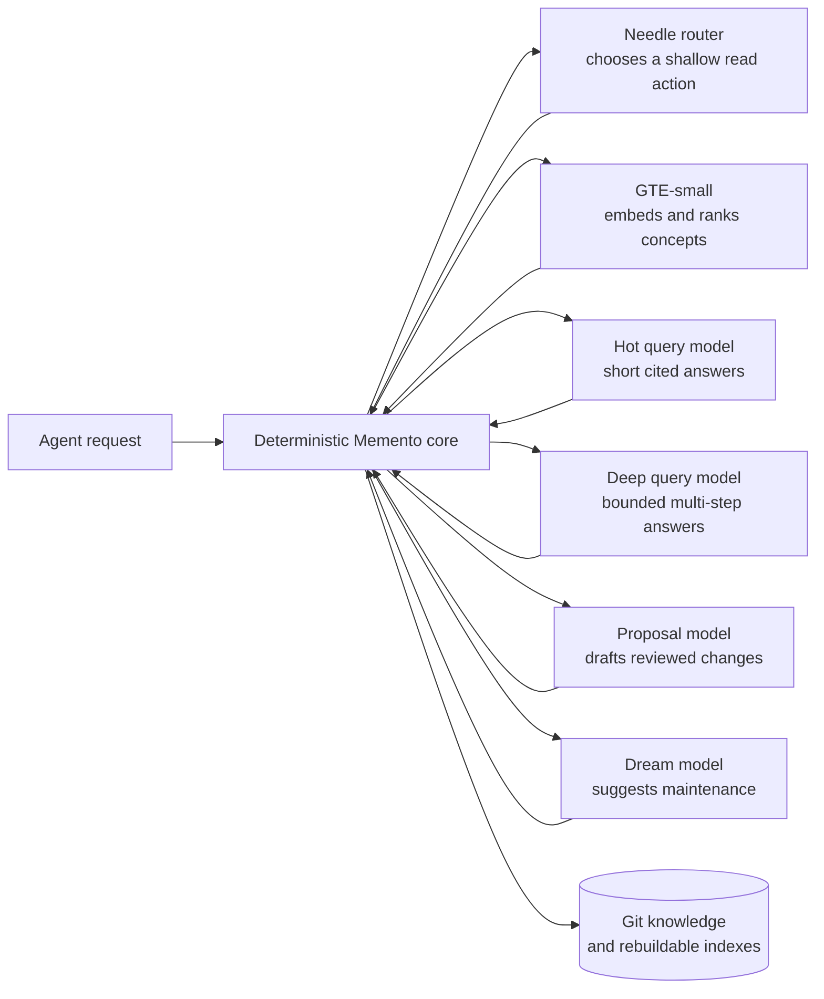

# Memento

An AI agent can remember several different kinds of things, and mixing them together causes trouble surprisingly quickly.

A conversation is short-lived working context. A reminder belongs to the agent that must deliver it. Credentials belong to one machine or user. But a fact such as "Smith runs Piclaw", "this service replaced that one" or "the backup lives here" may need to survive for years and be available to several agents.

Memento stores that last category: shared, durable knowledge. It was designed to solve this across multiple Piclaw instances, but Piclaw is not required: any MCP-enabled agent or client can connect, authenticate, search, read, submit proposals and--when granted the appropriate role--curate shared memory.



Needle is the small local traffic cop: it maps a natural-language read request to a bounded search, status, read or graph action, and abstains when the request does not fit. GTE-small turns queries and concepts into 384-dimensional vectors for semantic and hybrid ranking. The optional hot-query model produces short cited answers, while the deep-query model handles bounded multi-step traversal. The proposal model drafts changes for review, and the Dream model suggests maintenance from graph-health signals. None of them authorise callers or write directly--the deterministic Memento core validates every result and owns Git, policy and persistence.

## Piclaw, MCP, And Agent Memory

[`piclaw`][piclaw] is the motivating self-hosted agent runtime. A Piclaw instance has its own chats, local notes, reminders, scheduled jobs, tools and credentials. You might run one instance as a personal assistant, another near a home server and a third for a project. Each should remain operationally independent. Other MCP clients use the same authenticated tools and contracts; Memento does not depend on Piclaw-specific chat, storage or extension APIs.

That independence creates a memory problem. If two agents both need the same facts, copying Markdown between them produces several versions of the truth. Sharing their entire chat database is worse--private conversations, credentials and reminders have different owners and retention rules.

Memento sits between those two bad options. It gives multiple agents one shared knowledge base while leaving their conversations and local state alone.

```text
Personal agent ──┐
Server agent ────┼── authenticated MCP ──> Memento ──> shared Markdown knowledge
Project agent ───┘                              ├──────> operation journal
                                                └──────> search indexes
```

MCP, the Model Context Protocol, is the interface the agents use to search, read and propose changes. An agent does not receive direct filesystem or Git access.

## What Goes Into Shared Memory

Memento stores durable concepts: people, projects, machines, services, decisions and relationships that should outlive any one conversation. Each concept is an ordinary Markdown file with structured metadata, a stable ID and links to related concepts.

Examples include:

* where a service runs and who owns it;
* why one system replaced another;
* which project depends on a particular machine;
* aliases, tags and links needed to find the same fact later;
* reviewed operational knowledge that several agents should use consistently.

The repository remains useful without Memento. A person can read it with a text editor, inspect its Git history, copy it to another machine and rebuild every search index.

Memento deliberately does not absorb:

* chat transcripts and temporary conversation context;
* an agent's private daily notes or local memory summaries;
* reminders and scheduled jobs;
* passwords, tokens, keychains or machine configuration.

Those stay with the agent that owns them.

## How An Agent Uses It

A normal read is straightforward: search for a topic, choose a matching concept and read it. More involved requests can use a bounded multi-step plan, such as searching for a project and then reading its first result.

Writes are proposal-first. An agent drafts a change, Memento validates it and an authorised curator reviews it before it becomes shared knowledge. A model can suggest wording or relationships, but deterministic code decides whether the caller is allowed to act, whether the paths are safe and whether a Git commit really succeeded.

This separation keeps agent memory useful without letting a plausible model response become an unreviewed fact.

## What Owns What

The storage rules are deliberately plain:

> Git owns knowledge; `control.sqlite` owns operations; search indexes are disposable; models are advisory.

Git is authoritative for concepts and history. Every accepted change produces a commit tied to the authenticated caller, operation and previous revision. Renames keep the same concept ID and update inbound links in the same transaction.

`control.sqlite` records proposals, repeated-request protection, write journals, leases and scheduler state. FTS5, graph metadata and optional vectors live in a separate derived database that can be rebuilt from Markdown.

## Reading Shared Memory

The compact MCP surface is intentionally small. It exposes:

* `memory_help`
* `memory_status`
* `memory_search`
* `memory_read`
* optional `memory_answer`
* `memory_execute`

Skill search and recall add two direct tools, giving a compact surface count of **7** without answers and **8** with answers enabled; enabling the Needle router adds `memory_route`.

Other configured surfaces include the dedicated skill-pack operations and are explicit and fixed:

* `standard`: **26** direct tools
* `read_only`: **10** direct tools
* `curator`: **16** direct tools without `memory_answer`, **17** with it
* `admin`: **27** direct tools

`memory_help()` takes no arguments. It returns a filtered payload that reflects the active tool surface and answer setting: available goals, supported formats, answer sources, search modes, catalog resources, workflow templates, visible direct tools, execute limits and any execute-only operations.

Detailed contracts live in MCP resources such as `memory://catalog`, `memory://catalog/{operation}` and `memory://workflow/{goal}`. The point is simple: keep routine model context small, disclose detail on demand and preserve the full compatibility surface when needed.

`memory_read` reads one authorised concept by path or concept ID. It returns the whole concept payload: `path`, `frontmatter` and `body`. It does not expose section-scoped reads.

`memory_execute` is a bounded declarative interpreter over existing service operations. It supports typed operations, saved references such as `$hits.results.0.path`, bounded intermediate values and at most one commit-capable step in a plan. It does not provide imports, loops, shell access, filesystem access or network access.

## Writing Shared Memory

Cross-instance writes are proposal-first:

```text
search -> read -> propose -> review -> apply -> Git commit -> index update
```

A proposer can describe a change and inspect its deterministic diff. A curator reviews and applies it against an expected repository revision. Stale writes conflict instead of trampling newer knowledge, and reusing an idempotency key returns the recorded result instead of producing a second commit.

Proposal review supports `approve`, `reject` and `request_changes`. A `request_changes` review sends the proposal back to `draft`; it is not a terminal side channel.

Model-assisted proposal creation exists through `memory_propose_freeform` and `memory_propose_update`. Those entries may search and read context, then draft an ordinary proposal. They cannot review, apply or publish their own work.

Direct `create`, `patch` and `rename` mutations exist, but the exposure is exact:

* on the `standard` and `admin` surfaces they are direct tools;
* on the `curator` surface they are **execute-only** operations reachable through `memory_execute` and catalog/workflow discovery.

There are no imaginary admin-only mutation families beyond the documented tool list. There is no general client-facing hard delete.

## Search

Lexical search uses weighted FTS5 fields for titles, aliases, paths, descriptions, tags and bodies. Graph indexing adds links, backlinks, orphan detection and broken-link reporting.

Optional semantic search uses a local Rust port of GTE-small:

* 384-dimensional, L2-normalised concept embeddings;
* a stable C ABI loaded from Python with `ctypes`;
* packed float32 vectors in the rebuildable derived database;
* a SQLite extension that implements validated cosine ranking;
* scalar plus runtime-selected AMD64 AVX2/FMA and ARM64 NEON kernels;
* deterministic reciprocal-rank fusion for hybrid retrieval.

The reviewed FP32 model is vendored at `rust/tests/fixtures/gte-small.gtemodel` and copied into the container at `/usr/local/share/memento/models/gte-small.gtemodel`. Its SHA-256 digest is `06d049fc4f67208665b05d840cc307c04d46770654a8fe25afb040f360abf171`; provenance and licensing are recorded in `docs/attribution.md`.

If model loading or vector indexing fails, lexical search remains available. Canonical writes still complete.

See [`docs/semantic-search.md`](docs/semantic-search.md).

## Optional Model Features

Memento is useful without an LLM. Optional, independently gated tiers add:

* an opt-in embedded Needle shallow router with a pure-Rust runtime, deterministic action expansion and AMD64 held-out/container evidence; it remains disabled by default, and measured ARM64 performance is pending;
* exact answer caching scoped by repository revision and authorisation visibility;
* a small hot working set over recent concepts and accepted answers;
* bounded read-only traversal with validated citations;
* model-assisted proposal drafting;
* Dream graph-health scans in report-only or proposal mode;
* task-specific provider slots with explicit data classifications and model-level fallback.

Models never authenticate callers, pick canonical paths, publish Git refs, approve mutations or declare that persistence succeeded. Deterministic code owns those decisions.

### Needle Router Performance

The release-mode Rust runtime was pinned to one logical CPU on an Intel Core i7-12700 and run serially over the untouched 360-case routing corpus. It preserved all 360 tool decisions.

| Measure | Result |
|---|---:|
| Warm p50 | 510.8 ms |
| Warm p95 | 554.6 ms |
| Sustained serial throughput | 1.95 requests/s |
| Peak RSS | 163.4 MiB |
| Cold process + model load + first request | 669 ms |

These are single-core measurements from one host, not portable SLOs. CPU frequency and host contention were not fixed. For capacity planning, recent Intel and AMD AVX2/FMA cores should land around 0.4-0.65 s warm p50; older AVX2 Intel cores around 0.65-1.0 s; ARM server-class NEON cores around 0.6-1.0 s; modern ARM SBC cores around 1.0-1.8 s; and low-power x86 around 1.2-2.5 s. Those ranges are projections until measured on the target hardware.

The full methodology, caveats and per-platform planning table are in [`docs/needle-performance.md`](docs/needle-performance.md); the machine-readable run is in [`docs/evidence/needle/rust-router-single-core-i7-12700.json`](docs/evidence/needle/rust-router-single-core-i7-12700.json).

## Complete Skill Packs

Memento can store complete, versioned agent skills rather than reducing them to searchable prose. Each accepted version consists of ordinary searchable Markdown containing the exact `SKILL.md` text plus an immutable ZIP stored through Git LFS. The ZIP may contain scripts, references and binary assets, but not executable binaries, links, nested archives or unsafe paths.

The skill workflow is deliberately storage-only:

```text
proposer submits ZIP + exact SKILL.md
    -> curator reviews and applies
    -> readers search the latest accepted version
    -> reader recalls latest or an explicit version
    -> client imports into .pi/skills/<name>/
```

Names use lowercase words and hyphens; versions are stable semantic versions. Search returns only the highest accepted version, while explicit recall can fetch any retained version. The newest five are retained by default, and pruning never removes the latest or a version referenced by an active proposal.

`memory_skill_get` returns the validated ZIP and generated manifest. The included Python helper `memento.skill_import.import_skill_pack` revalidates and atomically imports it into a workspace, normalises files as non-executable and refuses to overwrite an existing skill directory. Memento itself never installs, merges, enables or executes a skill.

## Safety And Recovery

Only one Memento process may hold the repository writer lease. Each mutation runs in a temporary Git worktree, validates exact changed paths and publishes `main` with compare-and-swap. The materialised checkout and derived indexes advance before the operation is marked successful, which gives the caller read-your-writes behaviour.

Startup recovery reconciles interrupted journal rows with Git history. The derived database can be deleted and rebuilt. Backups need the bare Git repository and a consistent SQLite backup with checksums; temporary worktrees, materialised checkouts and search indexes do not need to be preserved.

Tool arguments, Markdown, links, retrieved text and model output are all untrusted. Memento rejects traversal, symlinks, special files, reserved-file writes, oversized changes, stale revisions, namespace violations and likely secrets in model-authored proposals.

## Running It

Memento supports Python 3.12-3.14 and uses a Makefile as the stable development and CI interface:

```bash
make install-dev
make check
make coverage
make build-wheel
```

`make check` validates Python formatting, linting, strict types and tests, then runs Rust formatting, Clippy and the complete Rust workspace tests.

The service CLI provides:

```text
memento-serve --config /etc/memento/config.json serve
memento-serve --config /etc/memento/config.json status
memento-serve --config /etc/memento/config.json audit
memento-serve --config /etc/memento/config.json rebuild-index
memento-serve --config /etc/memento/config.json backup --output /path/to/backup
memento-serve --config /etc/memento/config.json restore --input /path/to/backup
memento-serve --config /etc/memento/config.json dream --mode report_only
```

Docker, Compose/Portainer, nginx and hardened systemd examples are included. The container runs as a non-root user with a read-only root filesystem and writable state under `/var/lib/memento`. The default GTE-small model is installed read-only in the image.

Start with [`examples/config.v1.json`](examples/config.v1.json), then read [`docs/operations.md`](docs/operations.md) before enabling writes.

## Project State

The deterministic repository, transaction journal, FTS/graph indexes, authenticated MCP service, proposal workflow, backup/restore tooling, compact tool catalog, bounded executor, optional model tiers and Rust semantic-search runtime are implemented and covered by local tests.

What is still missing is deployment evidence, not architecture. Published SBOM/provenance, production image digests, live Docker/systemd parity and a clean-host production restore drill remain pending. Those gaps are tracked in [`PLAN.md`](PLAN.md).

Repository-owned local load testing is documented in [`docs/load-testing.md`](docs/load-testing.md). Its thresholds are local validation thresholds, not service-wide production SLOs.

## Documentation

* [`PLAN.md`](PLAN.md) tracks implementation status and pending acceptance evidence.
* [`docs/implementation.md`](docs/implementation.md) records the implemented architecture.
* [`docs/diagrams.md`](docs/diagrams.md) shows request, proposal, mutation, recovery, search, router and Dream transitions.
* [`docs/decisions/`](docs/decisions/0001-keep-operation-worktrees.md) records consequential design decisions, including the [Needle feasibility study](docs/decisions/0002-needle-feasibility.md).
* [`docs/contracts.md`](docs/contracts.md) defines schemas, envelopes and MCP operations.
* [`docs/threat-model.md`](docs/threat-model.md) records trust boundaries and abuse cases.
* [`docs/semantic-search.md`](docs/semantic-search.md) covers the Rust GTE and SQLite vector tier.
* [`docs/operations.md`](docs/operations.md) covers deployment, health, backup and recovery.
* [`docs/load-testing.md`](docs/load-testing.md) covers the repository-owned load harness and local thresholds.
* [`docs/evidence/`](docs/evidence/README.md) contains reviewed local operational, HTTP and semantic reports.
* [`AGENTS.md`](AGENTS.md) defines contribution and validation rules.

## Credits

Memento's semantic-search runtime is derived from and validated against [`rcarmo/go-gte`][go-gte], whose model conversion, tokenizer and inference work provided the reference implementation for the Rust GTE port. The vendored GTE-small weights originate from [`thenlper/gte-small`][gte-small].

The embedded shallow router builds on [`cactus-compute/needle`][needle] and its 26M-parameter checkpoint. Memento adds the fine-tuned routing corpus and checkpoint, deterministic NDL1 conversion, pure-Rust inference runtime, SIMD kernels, C ABI and the validation boundary that keeps model output advisory.

Memento is MIT licensed. Third-party runtime, model and artefact details are recorded in [`docs/attribution.md`](docs/attribution.md).

[piclaw]: https://github.com/rcarmo/piclaw
[go-gte]: https://github.com/rcarmo/go-gte
[gte-small]: https://huggingface.co/thenlper/gte-small
[needle]: https://github.com/cactus-compute/needle
