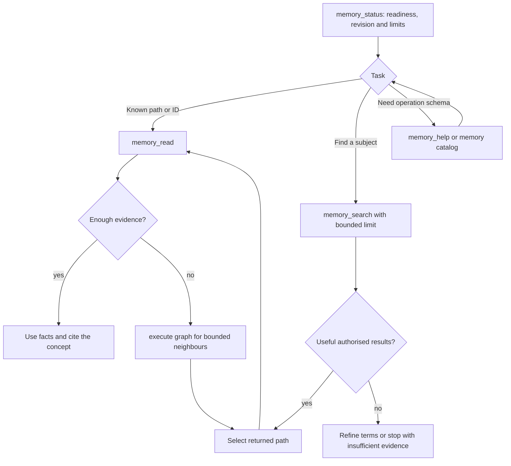
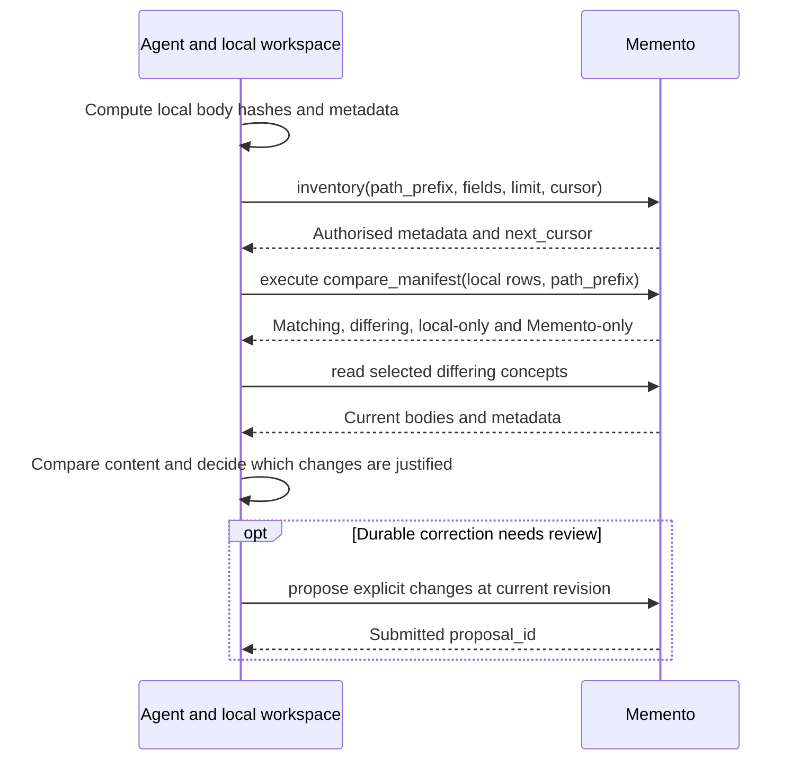
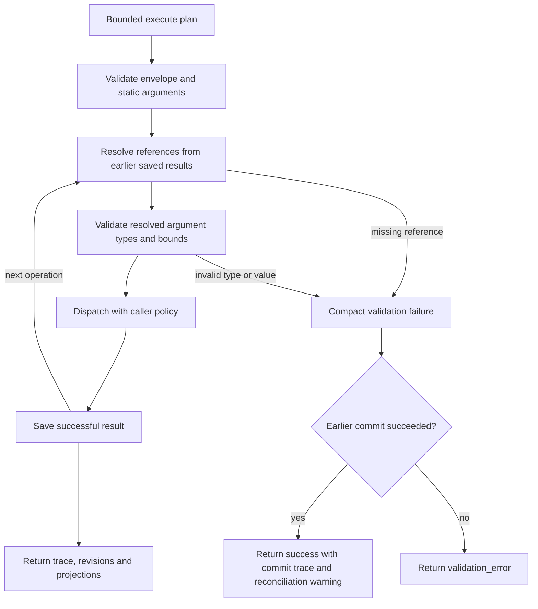
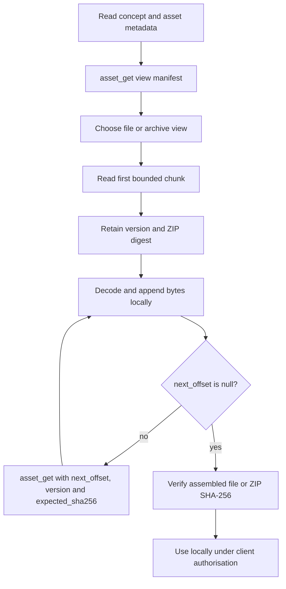
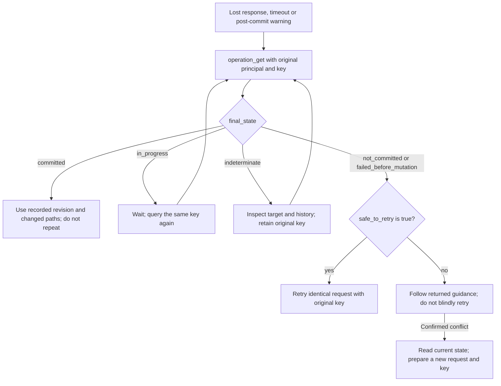
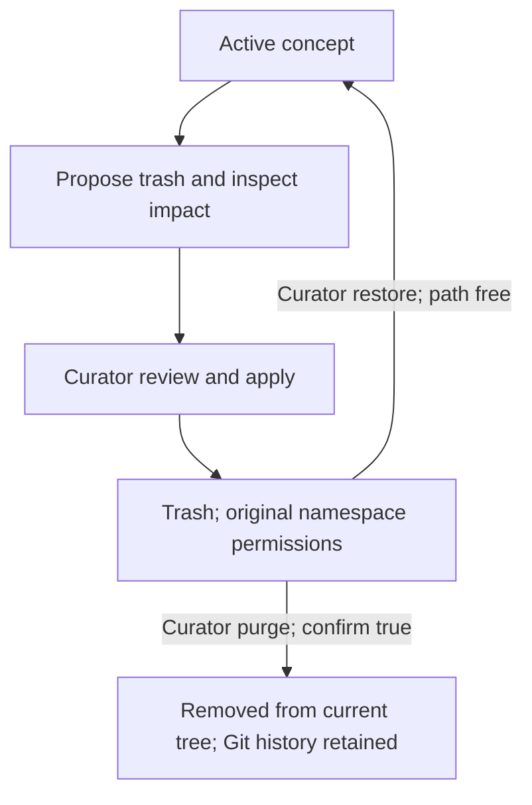

# Agent workflows

Agents use Memento to find, compare and propose durable shared knowledge under their own namespace grants. Keep chat transcripts, credentials, schedules and local scratch state outside shared concepts.

[Documentation index](README.md) · [Proposal review and refiling](proposals.md) · [MCP contracts](contracts.md)

## Discover, search and read

Start with `memory_status`. Inspect `memory_help` or `memory://catalog` for the tools, operations and limits exposed by the connected deployment. Compact clients use direct tools for common reads and `memory_execute` for other catalogued operations.



Plain search treats punctuation and operator words literally; choose `query_syntax: "fts5"` only for deliberate FTS5 syntax. Use semantic/hybrid search when the deployment reports ready embeddings, and inspect warnings if it falls back to lexical search. Treat returned paths as opaque identifiers. Authorisation filters candidates before ranking and output.

When enabled, `memory_route` classifies a shallow read request and dispatches a validated read operation. `UNKNOWN` is a safe abstention. Optional `memory_answer` returns citations and evidence; inspect both before relying on its prose. Neither routing nor answer generation grants write authority.

## Compare local and shared content

Use `memory_inventory` for path-ordered metadata, body digests and asset summaries without concept bodies. Follow `next_cursor` for subsequent pages. To compare a local collection, compute its manifest locally and use execute-only `compare_manifest` within the documented 50-row bounds.



Memento treats caller-local paths as labels and never opens them. A timestamp-based `likely_newer` result is a comparison hint; inspect the content before replacing a concept. Use `asset_metadata` when you need accepted versions, digests and skill/body parity without retrieving ZIP bytes. See [inventory and manifest contracts](contracts.md#memory_read-memory_list-memory_inventory-memory_graph-memory_audit).

## Chain operations with saved results

Execute plans accept concrete values or saved references in arguments. Each reference resolves from an earlier successful operation in that plan, then the original argument type and bounds are checked before dispatch. Direct tools require concrete values.



Keep at most one Git-commit-capable operation in a plan. `stop_on_error` governs errors returned by dispatched operations; reference/argument failures abort processing. Post-commit failures retain the commit result, so inspect warnings even when the outer envelope says `success`.

A search-then-read plan needs a non-empty result. Inspect search results first if an empty match is normal for the task; `$hits.results.0.path` fails when there is no first result. Plans have no loops or conditional branches. Use another bounded client call when the next operation depends on a result test.

[Saved-reference contracts](contracts.md#saved-references-and-projections) define identifiers, projection fields and limits. The [proposal guide](proposals.md) has complete execute examples.

## Retrieve an accepted skill or asset

Read metadata before downloading content. Use manifest view to inspect files, file view for selected members and archive view when the whole pack is needed. Downloading a skill does not authorise its installation or execution.



Offsets count bytes. A null `next_offset` means EOF and must not be passed back as an integer offset. With a known non-final first chunk, an execute plan can pass `$first.file.next_offset`, `$first.version` and `$first.zip_sha256` to its second read. For an arbitrary number of chunks, check EOF in the client between requests. Nonzero offsets require the pinned version and ZIP digest.

[Accepted-asset retrieval](accepted-assets.md) defines encodings, default/maximum chunks and integrity checks. [Skill review](proposals.md#review-a-skill-or-asset-update) covers staged bytes before approval.

## Reconcile an interrupted write

Save the authenticated principal, exact mutation arguments and idempotency key before dispatch. If the response is lost, timed out or includes a post-commit warning, call execute-only `operation_get` using the original principal and key. A different credential identity cannot reconcile that principal's operation. Apply the same procedure to a lost proposal rebase or keyed review response.



```json
{
  "operations": [{
    "op": "operation_get",
    "args": {"idempotency_key": "<original mutation key>"}
  }]
}
```

`operation_get` accepts exactly one of `idempotency_key` or `operation_id`. Curators reconcile their own mutations; original proposers can also reconcile their own proposal rebases. Review and rebase journal control-state changes atomically and return operation IDs. Its `safe_to_retry` and `retry_guidance` fields determine the next action. An absent key can return `not_committed` with permission to retry the identical request. A recorded conflict also returns `not_committed`, but requires current state, a fresh expected revision and a new key. Do not infer safety from the state name alone.

Changing the payload under an existing key causes `idempotency_conflict`. Once committed, use the recorded result even if index refresh or later execute processing failed. [Operation contracts](contracts.md) and [system recovery diagrams](diagrams.md#operation-recovery) describe server-side reconciliation.

## Archive and restore shared knowledge

Prefer a [reviewed trash proposal](trash.md#reviewed-archival) for routine retirement. The curator inspects the bounded reference/asset impact before approval; apply retains the concept ID, assets and Git history. Restore requires an unoccupied original path. Purge requires a separate explicit decision and `confirm: true`.



Stale archival proposals need a new impact report and proposal. Normal discovery excludes Trash; `inventory(path_prefix="/trash/")` includes accessible archived records. Use [Trash contracts](trash.md) for direct operations, limits and collision handling.

## Keep credentials and administration separate

Ordinary agents use scoped reader/proposer credentials. Curators receive only the namespaces they manage. Identity comes from authenticated MCP context; it is never a memory argument. Administrators use a separate profile for direct `access_*` tools and capture one-time credentials in the intended secret store.

The trusted graph debugger is unauthenticated when enabled. Its **View as** mode simulates visibility for diagnosis; it does not change the active MCP identity. [Access management](access-management.md) and the [threat model](threat-model.md) define these boundaries.
