# Memento transition diagrams

These diagrams describe the implemented control flow and durable states. They use the same names as the Python models, SQLite rows, MCP tools and Git references.

## Shared memory boundary

Piclaw instances share durable concepts through Memento. Conversations, local Dream memory, schedules and credentials do not cross this boundary.

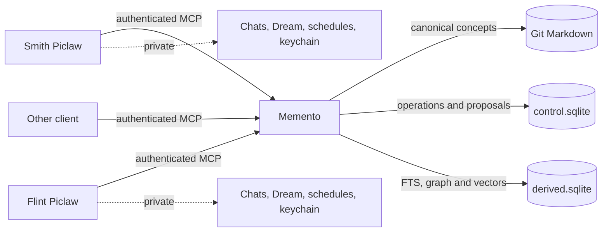

Git owns knowledge. The control database owns durable operation state. Derived indexes can be deleted and rebuilt.

## Model and storage architecture

Memento uses small specialist models behind deterministic boundaries. GTE-small embeds concepts for semantic retrieval. The Rust Needle router classifies shallow read requests. Optional completion-model slots handle answer synthesis, proposal drafting and Dream drafts; they never own policy or persistence.

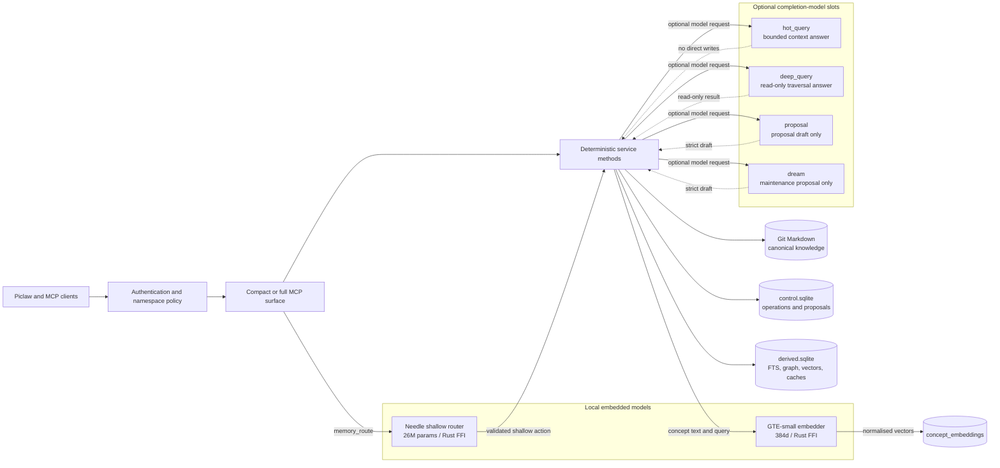

Needle and GTE run locally with vendored artefacts. Completion slots can also be local; cross-boundary fallback is opt-in per slot. Deterministic code validates every model result.

## Compact MCP request routing

The compact MCP surface keeps detailed operation schemas out of initial model context. Catalog and workflow resources disclose them when needed.

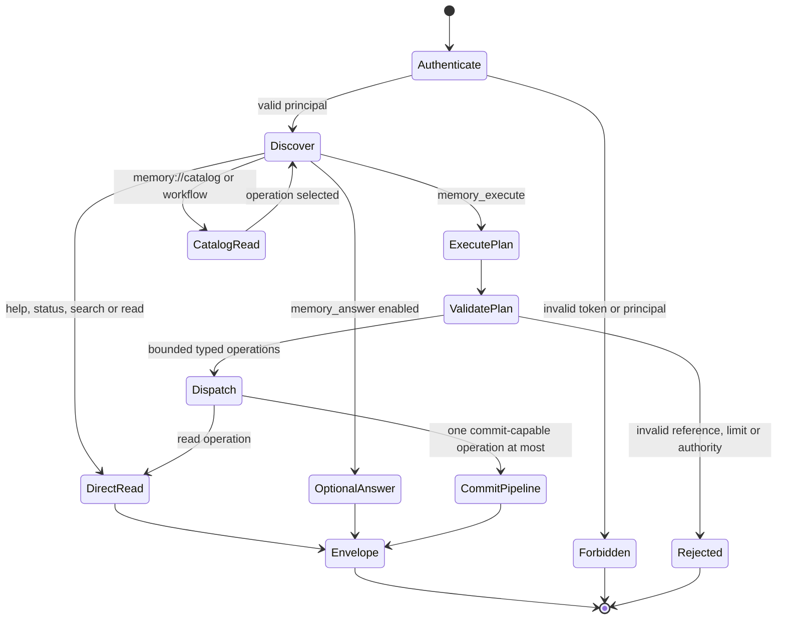

Every dispatched operation still enters the ordinary service method, so compact execution cannot bypass authorisation or mutation rules.

## Compact surfaces and execute-only operations

Direct tool counts vary by surface; optional answers and routing add one tool each where enabled.

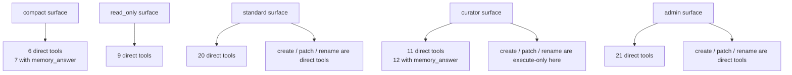

## Needle router lifecycle

Needle has two distinct histories: the failed full-plan attempt and the successful shallow router. The router now runs through the embedded Rust FFI runtime; ARM64 performance evidence remains a deployment follow-up.

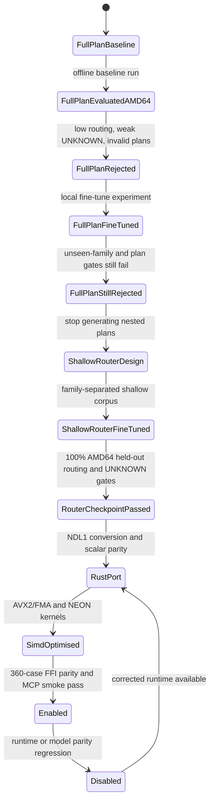

The current repository state is `Enabled` when `intelligent_tiers.needle_router.enabled` is true. The default remains disabled so deployments opt into the extra model load explicitly.

## Needle shallow router action boundary

Needle classifies a request into a shallow action. It does not generate Git mutations, authoritative paths or nested execution plans. Memento expands those actions deterministically.

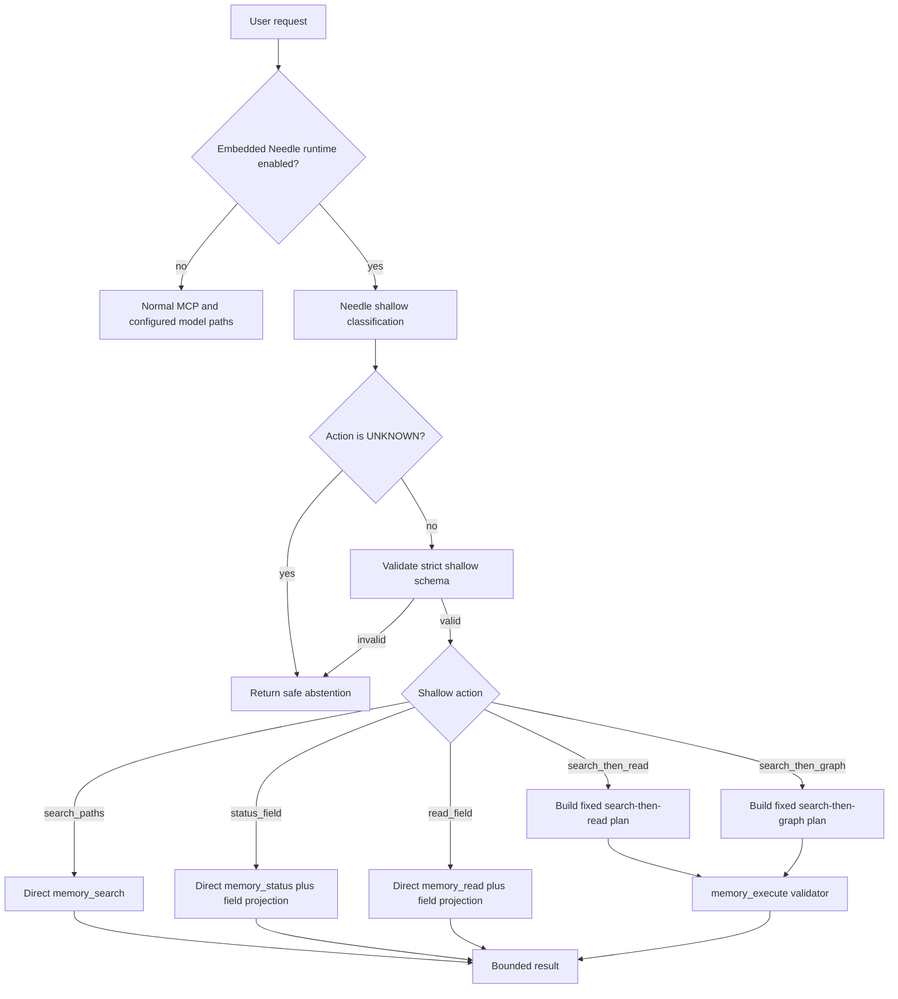

## Typical request processing

This sequence covers the read path, with local routing and answer synthesis when enabled. Direct tool calls and Needle-routed requests use the same service methods.

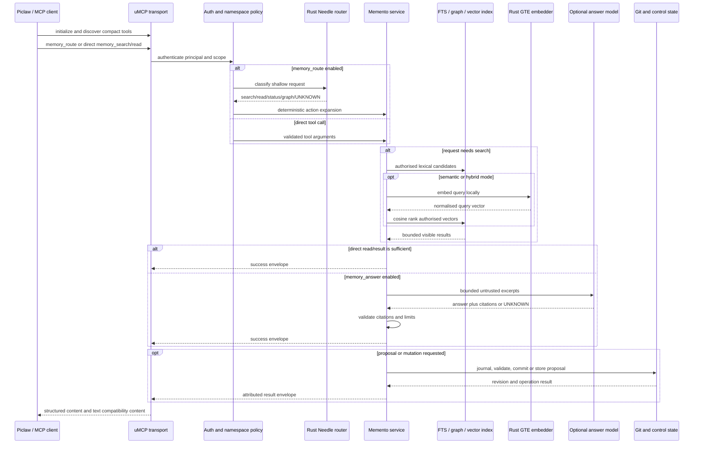

An `UNKNOWN` router result stops before search or mutation. A model-produced proposal still enters the normal review lifecycle below.

## Proposal lifecycle

Models and ordinary clients may create proposals. Only authorised curators can review and apply them.

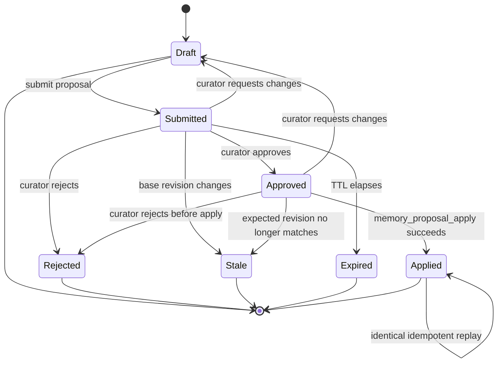

Model-assisted proposal creation enters the same ordinary lifecycle. It does not gain review or apply powers.

## Canonical mutation publication

The detached worktree is an isolation and recovery boundary. Readers do not see the mutation until the Git ref is published and `current/` advances.

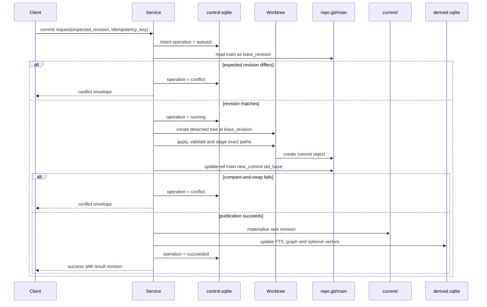

The worktree decision and measured overhead are recorded in [ADR 0001](decisions/0001-keep-operation-worktrees.md).

## Operation recovery

Interrupted journal rows are reconciled with canonical Git history before abandoned worktrees are removed.

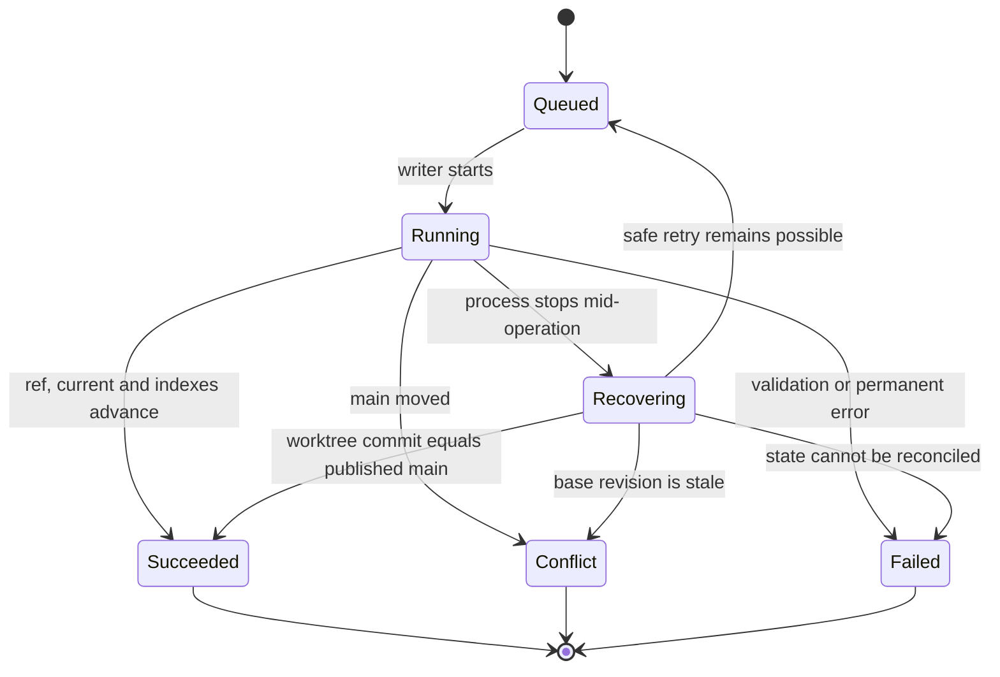

Idempotent callers observe the stored successful result rather than creating a second commit.

## Search and semantic degradation

Lexical search remains available when optional semantic components are missing or stale.

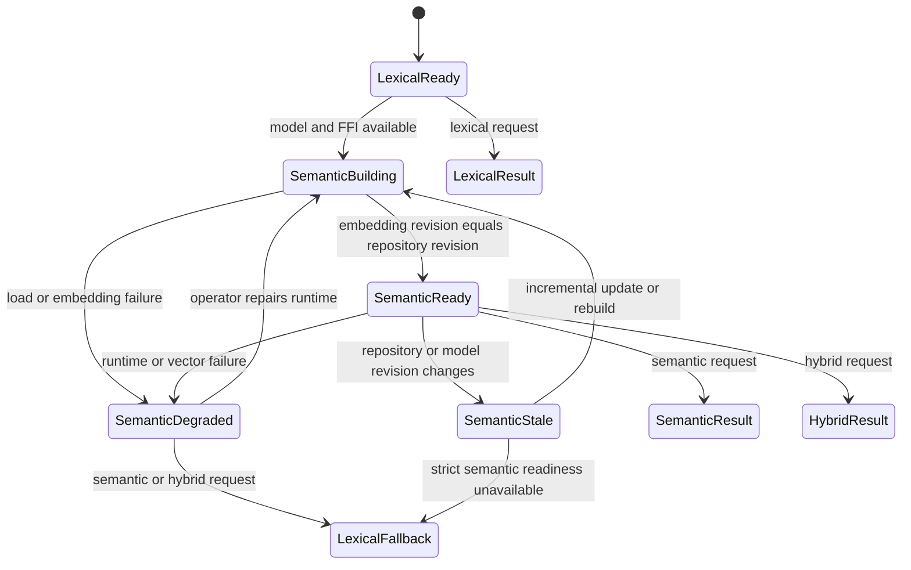

Semantic failure does not roll back a canonical write. Memento advances lexical indexes, records degraded semantic readiness and returns an explicit warning.

## Dream maintenance

Dream scans deterministic repository signals. Model use is optional and can only produce ordinary proposals.

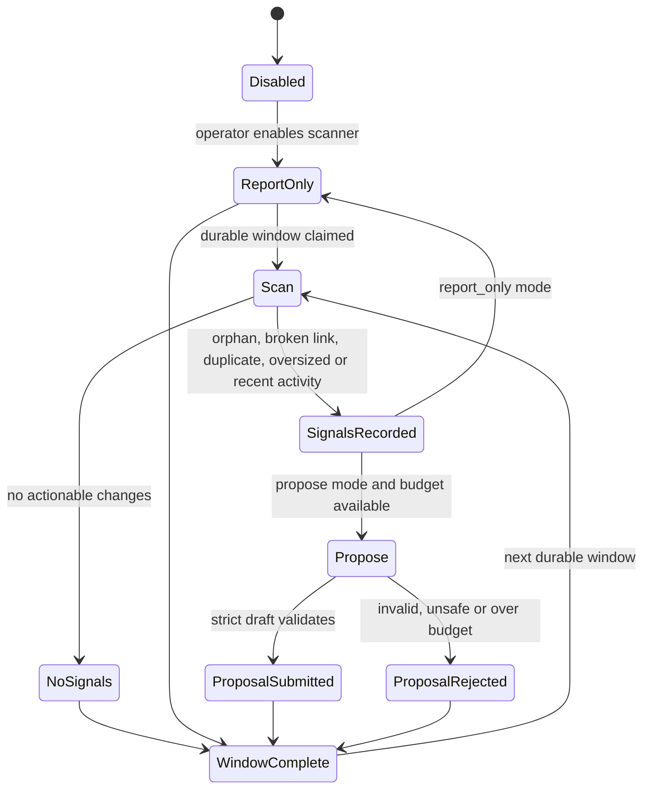

Dream never reviews, applies or publishes its own proposal.
