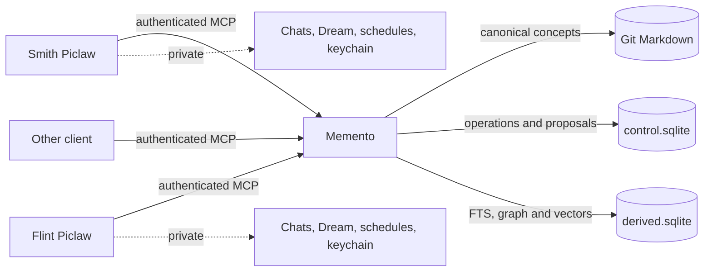
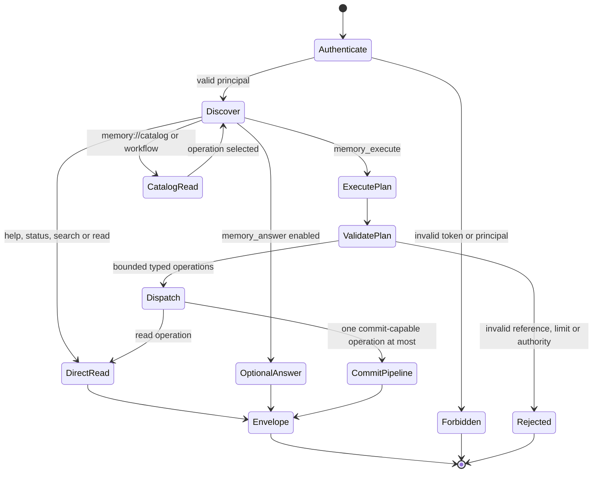
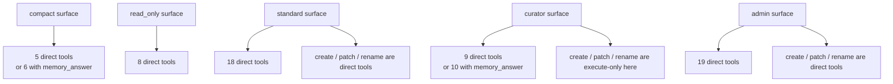
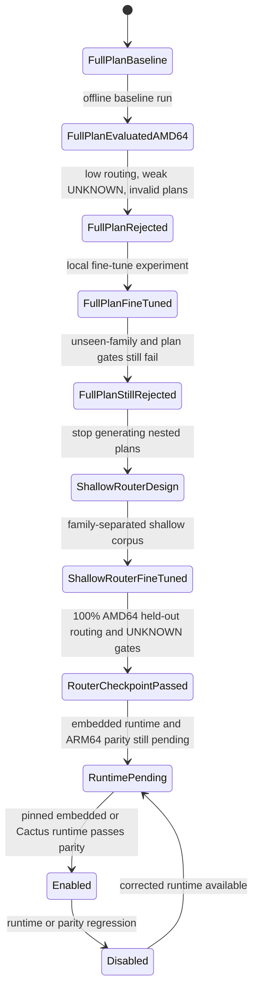
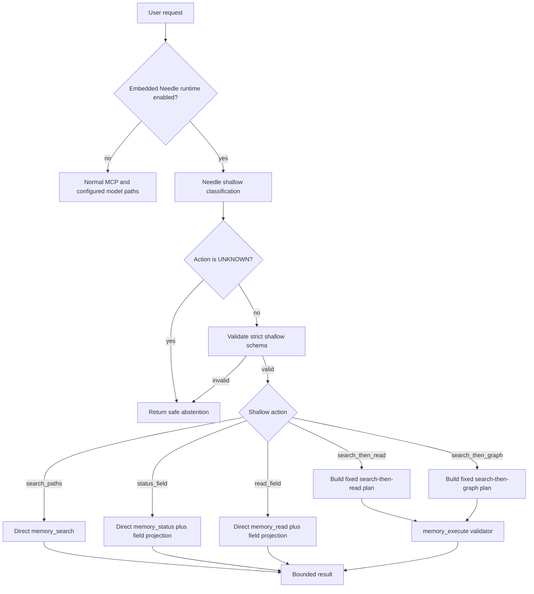
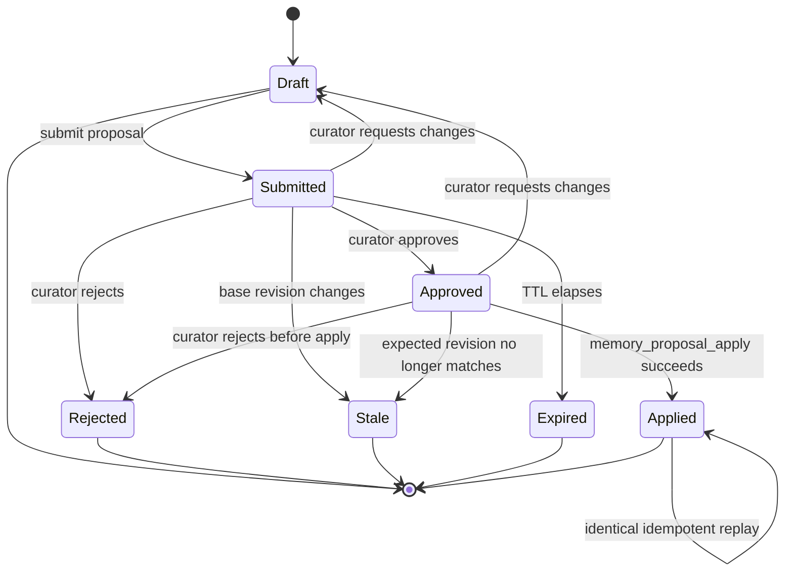
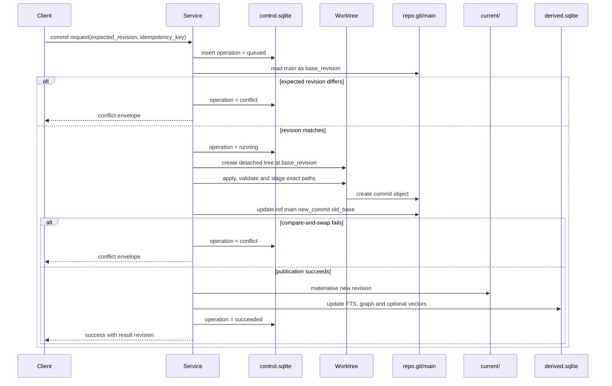
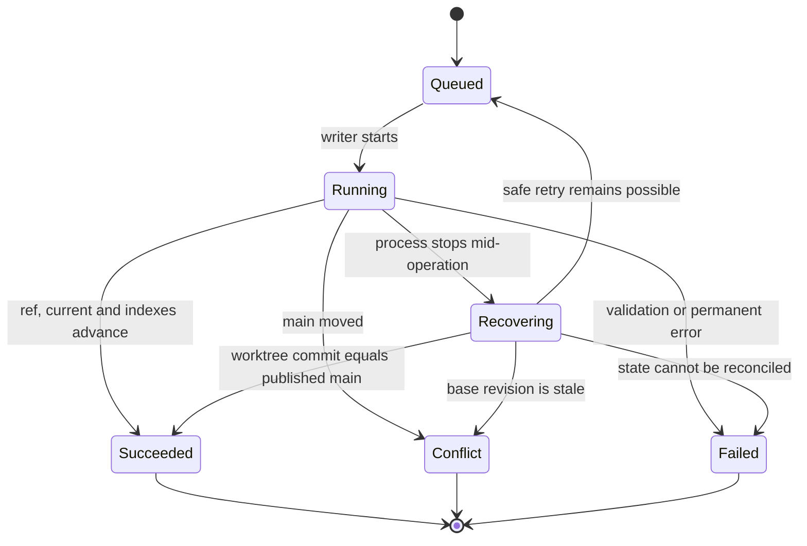
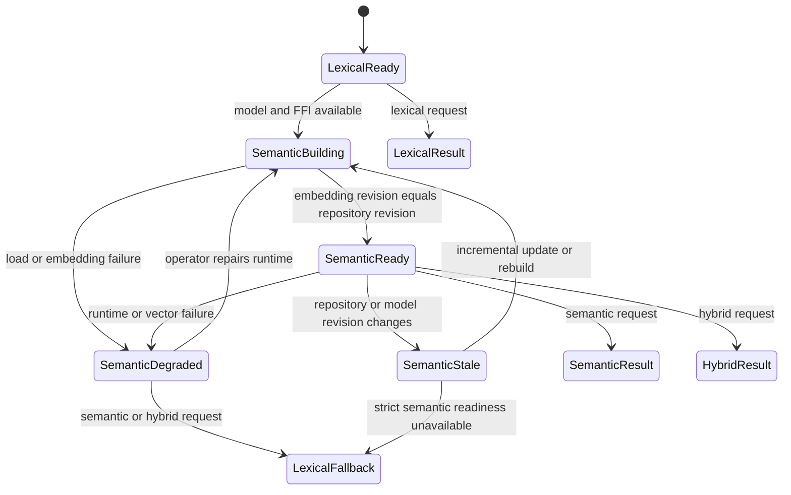
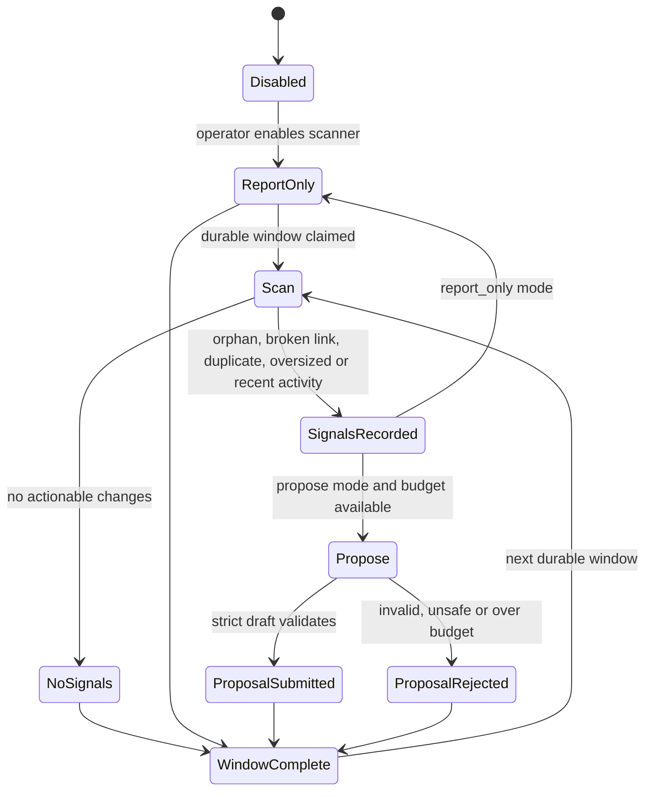

# Memento transition diagrams

These diagrams describe the implemented control flow and durable states. They use the same names as the Python models, SQLite rows, MCP tools and Git references.

## Shared memory boundary

Piclaw instances share durable concepts through Memento. Conversations, local Dream memory, schedules and credentials do not cross this boundary.

Git owns knowledge. The control database owns durable operation state. Derived indexes can be deleted and rebuilt.

## Compact MCP request routing

The compact MCP surface keeps detailed operation schemas out of initial model context. Catalog and workflow resources disclose them when needed.

Every dispatched operation still enters the ordinary service method, so compact execution cannot bypass authorisation or mutation rules.

## Compact surfaces and execute-only operations

This is the part that is easy to blur in prose, so the diagram makes it explicit.

## Needle router lifecycle

Needle now has two distinct histories: the failed full-plan attempt and the later successful shallow router. The passing checkpoint is still not enabled.

Passing the router checkpoint does not enable the runtime. The current repository state is `RuntimePending`.

## Needle shallow router action boundary

Needle classifies a request into a shallow action. It does not generate Git mutations, authoritative paths or nested execution plans. Memento expands those actions deterministically.

## Proposal lifecycle

Models and ordinary clients may create proposals. Only authorised curators can review and apply them.

Model-assisted proposal creation enters the same ordinary lifecycle. It does not gain review or apply powers.

## Canonical mutation publication

The detached worktree is an isolation and recovery boundary. Readers do not see the mutation until the Git ref is published and `current/` advances.

The worktree decision and measured overhead are recorded in [ADR 0001](decisions/0001-keep-operation-worktrees.md).

## Operation recovery

Interrupted journal rows are reconciled with canonical Git history before abandoned worktrees are removed.

Idempotent callers observe the stored successful result rather than creating a second commit.

## Search and semantic degradation

Lexical search remains available when optional semantic components are missing or stale.

Semantic failure does not roll back a canonical write. Memento advances lexical indexes, records degraded semantic readiness and returns an explicit warning.

## Dream maintenance

Dream scans deterministic repository signals. Model use is optional and can only produce ordinary proposals.

Dream never reviews, applies or publishes its own proposal.
