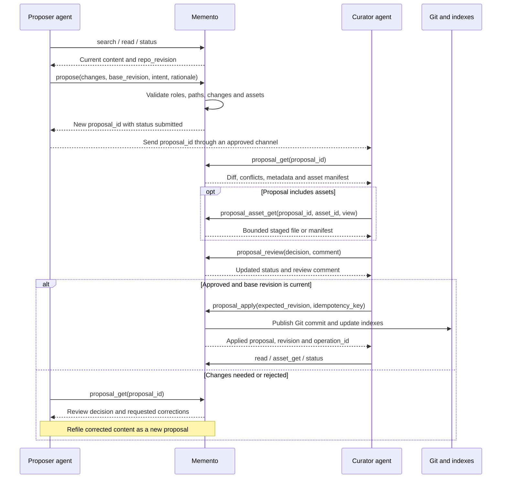
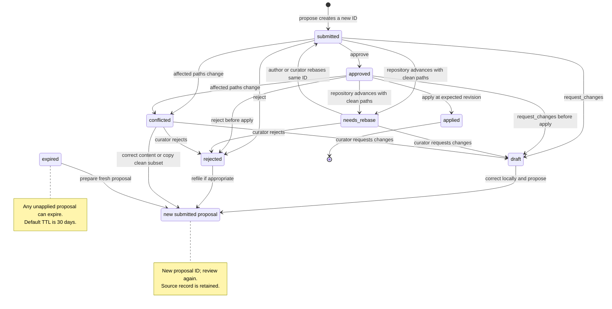
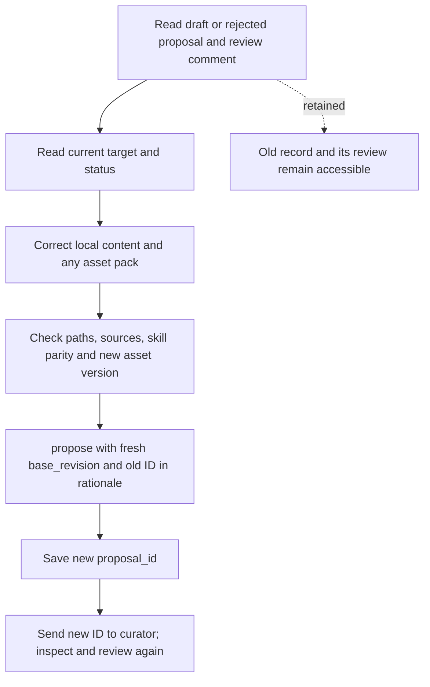
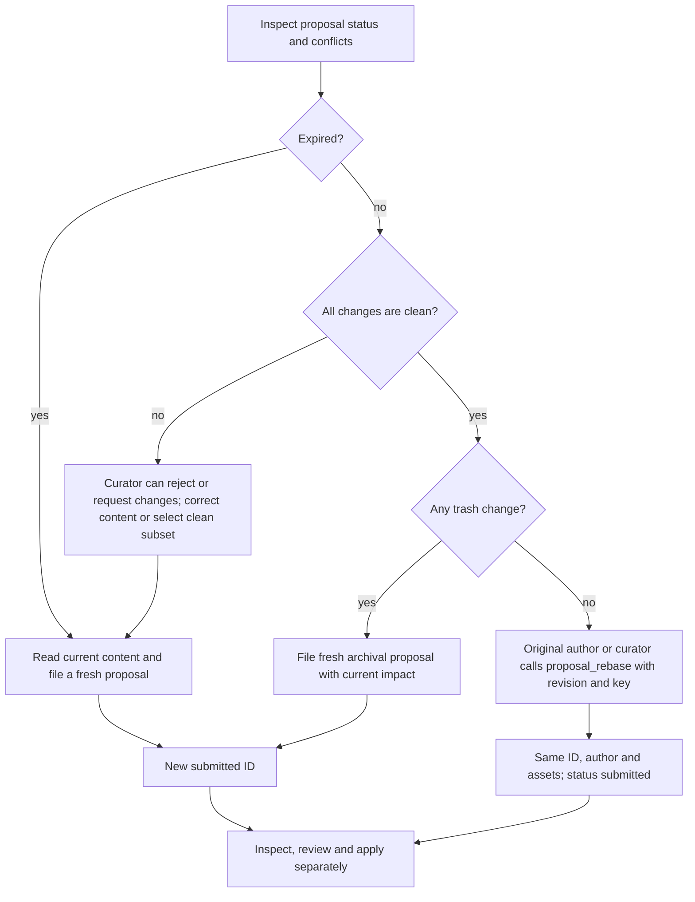
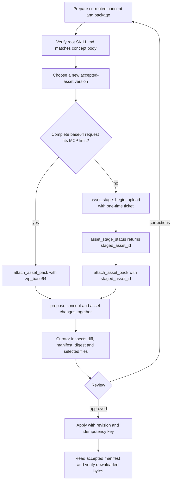

# Submit, review and refile proposals

A proposal stores proposed changes for curator review. Git changes only when an authorised curator applies an approved proposal. Corrected content is submitted under a new proposal ID; there is no edit-and-resubmit API for an existing draft.

[Documentation index](README.md) · [Agent workflows](agent-workflows.md) · [Exact contracts](contracts.md#proposal-records-and-lifecycle)

Operation names below are `memory_execute` operations. Use the corresponding direct `memory_*` tool only when the connected catalog exposes it. `memory_status`, `memory_help` and `memory://catalog` describe the deployment. Proposing requires the `proposer` role and write access to the affected paths. Proposal get/list and staged-asset inspection also require `proposer`. Review, subset revision and apply require `curator` plus read/write access to every affected path. The original proposer can also rebase their own clean proposal in place under the same namespace checks. Give a working curator profile `reader`, `proposer` and `curator` roles with the intended namespace grants.

## Submit and review

Search and read the current concepts before preparing changes. `propose` creates a new record directly in `submitted` state. It has no separate submit step. Save the returned `proposal_id`, then inspect its diff, target paths, base revision and any asset manifest before requesting review.



Memento stores the review result. Agents arrange hand-off through their approved messaging channel or inspect `proposal_list`; proposal creation does not send a peer message. An author can read their own accessible proposals. Curators can inspect other authors' proposals within their namespace grants. A curator can review their own proposal when policy permits it; keep the actual author and reviewer identities.

Use `proposal_list(status="unresolved")` for the review queue: it includes draft, submitted, approved, needs-rebase and conflicted records. `memory_status.proposal_backlog` counts the same unresolved records visible to the caller. Use `status="submitted"` only when you need that exact state; `pending` is not a valid status. Follow `next_cursor` until null when reviewing more than one page.

An explicit patch submission through `memory_execute`:

```json
{
  "operations": [{
    "op": "propose",
    "args": {
      "intent": "Correct the service ownership record",
      "base_revision": "<fresh repo_revision>",
      "rationale": "The owner confirmed the change.",
      "changes": [{
        "kind": "patch",
        "path": "/projects/example.md",
        "body": "<complete revised body, retaining facts that still apply>"
      }]
    },
    "save_as": "submission"
  }],
  "returns": [{"ref": "$submission.proposal", "fields": ["proposal_id", "status", "base_revision"]}]
}
```

Replace example paths and angle-bracket values before calling. `patch.body` replaces the body; supply the whole intended body. `propose_update` is a model-assisted draft from an instruction, not an edit to a stored proposal. Model-assisted submission requires the deployment's proposal model configuration.

## Choose a review decision

| Decision | Stored status | Use and next action |
| --- | --- | --- |
| `approve` | `approved` | The reviewed changes are ready. Apply separately while the base revision is current. |
| `request_changes` | `draft` | Describe the corrections. The author files corrected content as a new proposal. |
| `reject` | `rejected` | Record why these changes should not be applied. If a corrected replacement is appropriate, file a new proposal and cite the old ID. |

Review changes status and review metadata; it does not edit the stored patch. Applied and expired proposals cannot be reviewed again. Curators can reject or request changes on an old-base or conflicted proposal. Approval and apply recheck per-change conflicts and the current revision under the same repository lock. Clean old-base proposals return `needs_rebase`; overlapping paths return a conflict result. Other states, including draft and rejected, can receive a later decision on unchanged content, subject to these freshness checks.

These are the normal submission and recovery paths; later review decisions on unchanged patches are described in the table above.



A changes-requested review call:

```json
{
  "operations": [{
    "op": "proposal_review",
    "args": {
      "proposal_id": "<proposal_id>",
      "decision": "request_changes",
      "idempotency_key": "<unique review key>",
      "comment": "Include the source for the ownership change and retain the existing recovery instructions. Refile the complete corrected body and cite this proposal ID."
    }
  }]
}
```

For approval, use `decision: "approve"` after inspection. Then issue a separate apply call with `proposal_id`, fresh `expected_revision` and a unique, durable `idempotency_key`. Preserve that exact request and key for [reconciliation](agent-workflows.md#reconcile-an-interrupted-write). Approval itself creates no Git commit. Supply `idempotency_key` on review for durable replay and reconciliation. Existing clients may omit it; the response still includes an operation ID. Review history is retained as append-only events.

## Refile corrected content

Read the review comment and current concept before changing the local draft. Address each requested correction, preserve still-valid content and submit against a fresh revision. Include the previous proposal ID and the corrections in `rationale`; this is a human-readable link. Ordinary `propose` does not create a structured supersession relationship.



There is no `proposal_edit`, `proposal_resubmit` or operation that replaces a draft's patch. Avoid repeated `propose` calls after a lost submission response: proposal creation has no idempotency-key argument. Inspect your proposal list for the recorded submission before deciding whether to file another.

## Handle a stale or expired proposal

From 0.5.7, repository advancement classifies unresolved older proposals as `needs_rebase` when their affected paths are clean or `conflicted` when paths overlap. Both stay visible and reviewable. Legacy `stale` records are classified on refresh; the legacy list filter `status="stale"` aliases `needs_rebase`. A status change caused by repository advancement records a system audit event. Inspect `proposal_get` for conflicts and its most recent 50 history events.

If a retained base revision is invalid or no longer available, its changes are marked conflicted with `base_revision_unavailable` guidance. The record stays visible and reviewable; inspect current content and file a fresh proposal rather than rebasing unverifiable changes.

Use execute-only `proposal_rebase` to advance a clean proposal's base in place. The original proposer or an authorised curator supplies its ID, a current `expected_revision` and a durable `idempotency_key`. The ID, author, content, patch hash, attached bytes, creation time and expiry remain unchanged. `updated_at` records the rebase time; previous reviews are retained in history, current approval is cleared, and the proposal becomes `submitted` for fresh review.



The separate `proposal_revise` operation accepts a needs-rebase or conflicted source. It copies selected clean changes into a new submitted proposal authored by the curator, using the current revision. It records `source_proposal_id` and `source_change_indexes`, retains the source and requires paired concept/asset changes to stay together. It cannot edit selected content. Conflicting changes require a freshly prepared proposal. Expired proposals also require fresh submission.

```json
{
  "operations": [{
    "op": "proposal_rebase",
    "args": {
      "proposal_id": "<needs_rebase proposal_id>",
      "expected_revision": "<fresh repo_revision>",
      "idempotency_key": "<unique rebase key>"
    }
  }]
}
```

Rebase commits the proposal, audit event and successful operation journal atomically. Repeating the identical request/key returns the recorded result. After a timeout or lost response, the original proposer can call `operation_get` with that key; wait on `in_progress` and use the result once `committed`. Review, rebase and apply share the repository writer lock across worker connections. Concurrent applies at the same revision allow at most one publication; the other proposal remains unresolved.

For archival, obtain a fresh impact report through a new trash-only proposal. See [reviewed archival](trash.md#reviewed-archival). Do not confuse `proposal_revise` with Git history rewriting.

## Review a skill or asset update

Review both the concept and the packaged files. For a skill, ZIP-root `SKILL.md` must match the proposed concept body byte-for-byte in canonical UTF-8: LF endings, no trailing whitespace, no leading/trailing blank lines and no final newline. Preserve Unicode code points. Include the revised scripts and package metadata required to use the skill.



When refiling, package corrected bytes and use a version not already accepted for that concept/kind. An upload stage consumed by the old proposal cannot be reused; stage the replacement again or use inline ZIP bytes. A clean `proposal_rebase` retains all stored assets in place; `proposal_revise` can copy a selected clean subset into a new proposal without uploading those assets again.

Use `proposal_get` to obtain the generated asset ID and manifest, then `proposal_asset_get(view="file", file_path=...)` to inspect bounded content before approval. After apply, `asset_get` reads accepted versions. [Accepted-asset retrieval](accepted-assets.md) defines range, digest and EOF handling. Any client-side installation or script execution needs its own authorisation.

The lifecycle rules are implemented in [`internal/control/proposals.go`](../internal/control/proposals.go) and the `internal/service` proposal handlers; operation arguments are defined in [`internal/execute/arguments.json`](../internal/execute/arguments.json). The [contracts](contracts.md#proposal-records-and-lifecycle) define the exposed fields.
